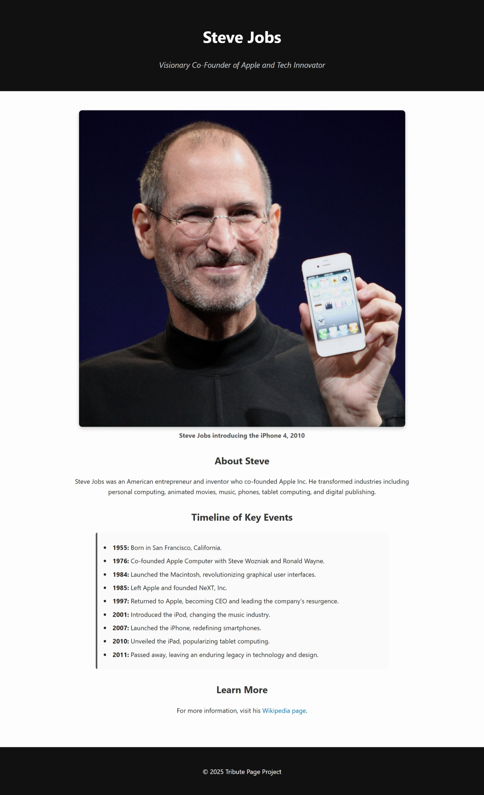

# Tribute Page: Steve Jobs

This is a responsive tribute page dedicated to **Steve Jobs**, built as part of the [freeCodeCamp Responsive Web Design Certification](https://www.freecodecamp.org/learn/2022/responsive-web-design/). The goal of this project is to apply basic HTML and CSS skills to create a visually appealing and accessible tribute page.

## 📸 Preview

## ✨ Features

- Clean and modern layout
- Responsive design for all screen sizes
- Subtle color theme and typography
- Highlights Steve Jobs' life and achievements in a timeline
- Built using only HTML and CSS

## 📁 Files

- `index.html` – The main HTML file that contains the structure of the page.
- `styles.css` – Custom CSS file for styling the tribute page.
- `steve.jpg` – An image of Steve Jobs used in the page.
- `Screenshot.jpeg` - A screenshot of tribute page.